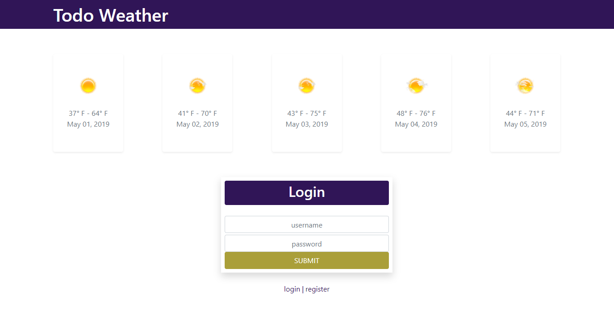

# Todo Weather Project

Visit @ [Todo Weather Project](http://todo-weather-project.54.218.142.71.xip.io)

## Test Login:

user: testuser
password: testpassword

## Summary:

The Todo Weather Project is my take on a simple responsive todo list app with the inclusion of a five day weather forecast.

## Application Details:

**Login | Register View**

This view starts the user as logged out with the option to login as the default. After the application has loaded and the 
WeatherList component mounts, the WeatherList component initializes a chain of requests that ultimately returns and displays a 
five day weather forecast from the AccuWeather API based on the user's client location via it's ip address. If the user does 
not have an account, they can toggle between "login" and "register" via the links below the login form. Simple client-side 
input data validation is implemented, and any database errors resulting from invalid account requests are displayed as an error 
message.

**Main View**

This view displays a header section with the application's title, the user's username, and a logout link. If the user's screen 
is below 568px wide then the username is not displayed. The next section is the five day forecast. For each day, the weather 
icon for the forecast type, the low and high temperatures, and the date are displayed. The next section is the todos section. 
The user can add todos from here and view all of their current todos ordered by most recently added. A user can interact with a 
todo by either clicking in the text area to toggle a todo as complete or incomplete, or clicking on the "x" icon to delete it.

**Notes:**
- Design was implemented using Bootstrap classes. The Bootstrap custom form validation was also used.
- The ipify API is used to retrieve the user's client ip address.
- The AccuWeather API is used to retrieve the five day forecast.
- Database setup and routes are included in the same file since this is a smaller application.

## Client-Side Technologies:

**Languages**

- CSS
- HTML
- JavaScript

**Libraries**

- React
- ReactDOM
- React Router DOM
- JQuery
- Popper.js
- Bootstrap
- Moment.js
- Classnames
- UUID

**Linters**

- ESLint

**Build Tools**

- Babel
- Webpack

## Server-Side Technologies:

**Languages**

- Python

**Libraries**

- Flask
- Flask-SQLAlchemy
- Requests
- Pipenv

**Database**

- SQLite

**Hosting**

- Amazon Web Services: Lightsail
- Ubuntu Server
- Apache HTTP Server
